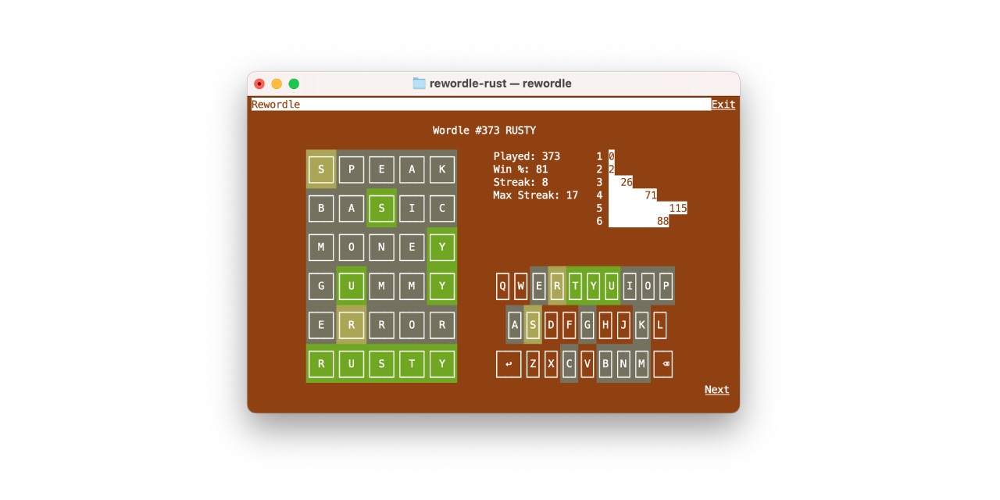

# Rewordle

Rewordle lets you play all the Worlde words from the beginning in the terminal.

It's written in [Rust](https://www.rust-lang.org/).

<p align=center></p>

# Install

## Pre Built Binaries

Pre built binaries are provided for each [release](https://github.com/ronilan/rewordle-rust/releases).

## From crates.io
Ruewordle is published as a crate on [crates.io](https://crates.io/crates/rewordle). If you have Cargo, you can install it with
```sh
cargo install rewordle
```

You will be able to invoke the binary as `rewordle`.
```sh
rewordle
```

## From Source
If you don't want to install a Rust crate, but do have Rust installed, you can build and run rewordle directly from source.

Clone this repository,
```sh
git clone https://github.com/ronilan/rewordle-rust.git
```

```sh
cargo run --release
```

# Use

Play it like Wordle!

###### Fabriqué au Canada : Made in Canada 🇨🇦