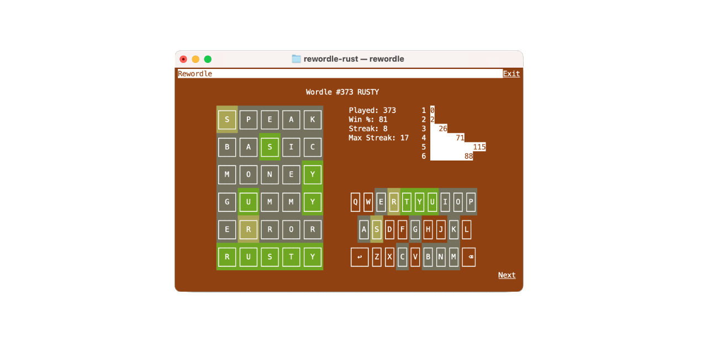

# Rewordle

Rewordle lets you play all the Wordle words from the beginning.

It can be be played in the terminal, using native macOS and Windows app or [right here in the browser](https://ronilan.github.io/shape_sorting/).

It's written in [Rust](https://www.rust-lang.org/) using the [Incredible](https://www.incredible.rs/) TUI framework.

<p align=center></p>

# Install

## Pre Built Binaries

Pre built binaries are provided for each [release](https://github.com/ronilan/rewordle-rust/releases).

## Linux via Docker

To try the Linux terminal version, build and run:

```
docker build -t rewordle .
docker run --rm -it rewordle
```

Type `rewordle` in the container shell to launch.

## TUI Install

The scripts fetch the right binary for your platform from the latest release and install it into `/usr/local/bin` (macOS/Linux) or `C:\Program Files\rewordle-rust` (Windows). No clone or build required.

```bash
curl --proto '=https' --tlsv1.2 -sSf https://raw.githubusercontent.com/ronilan/rewordle-rust/main/install.sh | bash
```

```powershell
irm https://raw.githubusercontent.com/ronilan/rewordle-rust/main/install.ps1 | iex
```

## WASM version

Available on web at: https://ronilan.github.io/rewordle-rust/

# Use

Play it like Wordle!

## Files

Stats (results, streaks, word progress) are kept in a `.rewordle` file under the OS app-data directory:

- macOS: `~/Library/Application Support/rewordle/.rewordle`
- Linux: `~/.local/share/rewordle/.rewordle` (or `$XDG_DATA_HOME/rewordle/.rewordle`)
- Windows: `C:\Users\<you>\AppData\Roaming\rewordle\.rewordle`

## Development

See [Development](./markdowns/DEVELOPMENT.md) and [Development Environment Prerequisites](./markdowns/DEVELOPMENT_PREREQUISITES.md)

---

*Fabriqué au Canada : Made in Canada 🇨🇦*
